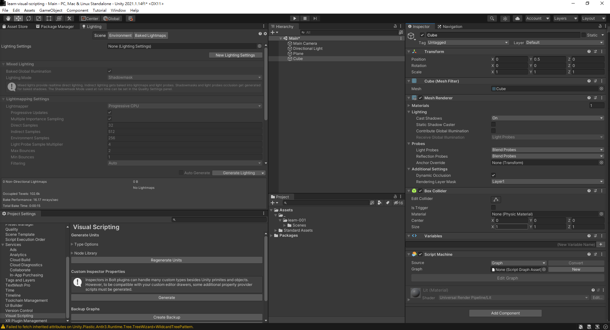
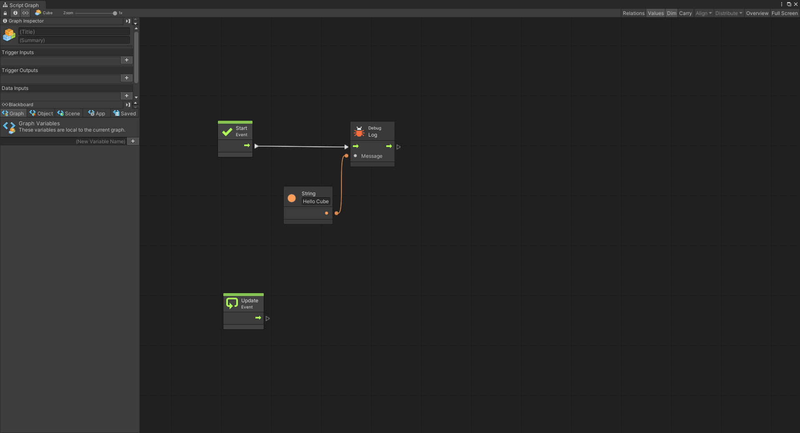
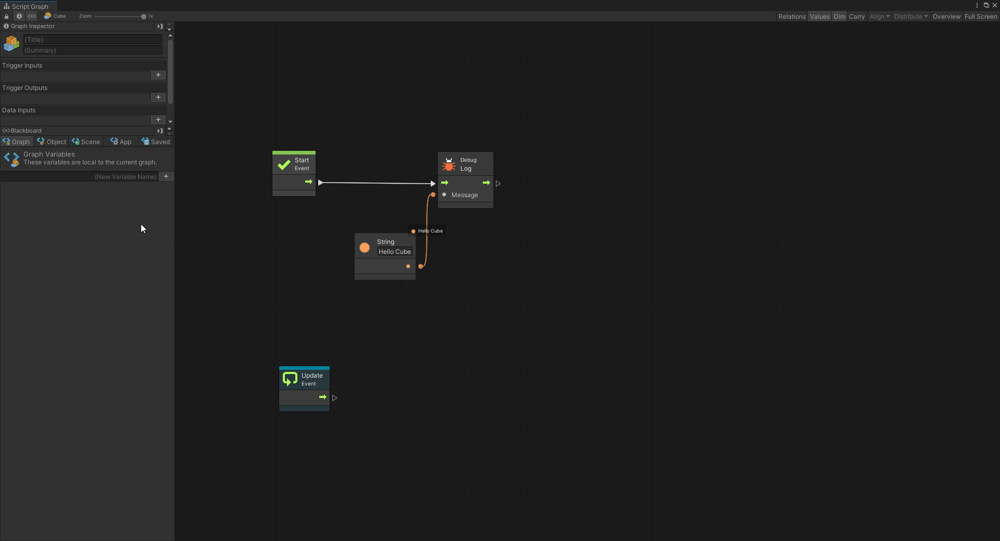
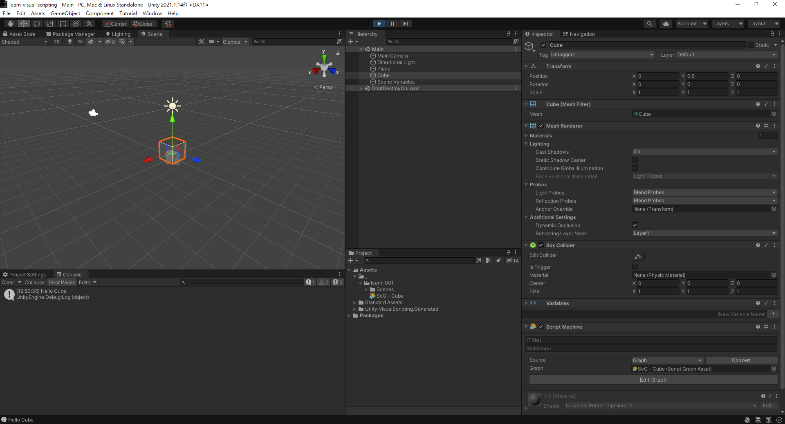

# Overview

1. Create a cube on the scene
2. Add ScriptMachine component to Cube
3. Click New at Graph and save the ScriptGraph asset anywhere



4. Click Regnerate Units in Visual Scripting section in ProjectSettings

In side ScriptGraph, add following nodes

- Debug with one message
- String literal



After adding these two nodes, can enter Play mode. While in play mode, there the ScriptGraph will be executed like this



Notice that the graph should be looking very similiar at editor time and run time. But in runtime, the node that is currently being executed is highlighted differently.

The following words should be printed on editor console.

```
Hello World
```

